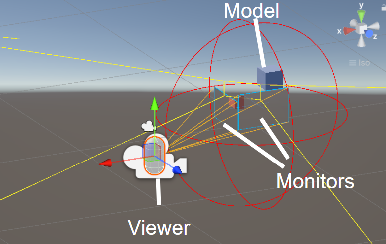
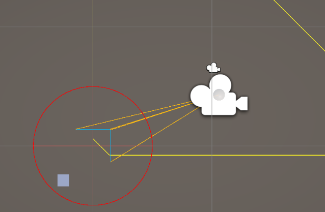
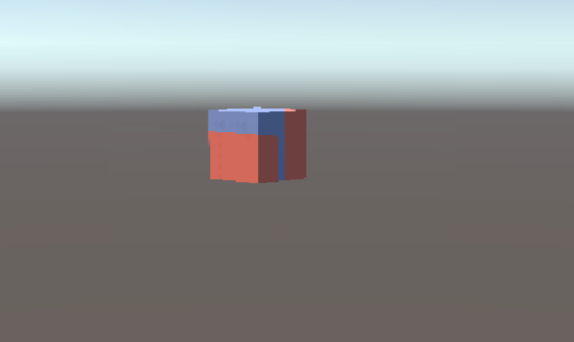
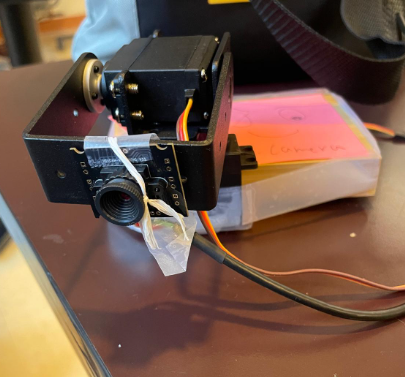

# IEEE Miku Showcase: Head-Coupled Off-Axis Projection

A real-time “holographic” display built with Unity and vision-based head tracking. The viewer’s head position is tracked in 3D and used to dynamically adjust the camera’s frustum, creating a convincing window-into-3D effect on one or more monitors.

This repository includes:
- A Unity project for perspective-correct rendering
- A Python head-tracking pipeline (MediaPipe/OpenCV) with optional ArUco marker tracking
- Optional Arduino pan-tilt rig for active webcam framing
- Optional wired/wireless link for sending tracking data to another machine

Note: This project is not affiliated with Portalgraph; it is an academic/club showcase inspired by similar techniques.

---

## Features

- Real-time head pose estimation (position + orientation)
- Perspective-correct projection in Unity for a window-like 3D illusion
- Multi-monitor support
- Optional ArUco-based tracking as a fallback or for testing
- Optional prediction filter to reduce jitter/latency
- Optional pan-tilt webcam control via Arduino servos
- Optional cross-machine streaming of tracking data (UDP/TCP)

---

## Quick Start

1) Clone the repository.

2) Install tracking dependencies (Python 3.9+ recommended):
```bash
pip install opencv-python mediapipe numpy
```

3) (Optional but recommended) Calibrate your camera for best depth accuracy using a checkerboard and OpenCV (see “Calibration”).

4) Open a Unity project in the specified Unity version (see “Requirements”). Import SampleScene.unity and UnityScripts into Unity. Enter your display’s physical dimensions and camera parameters in the calibration UI and adjust the location/number of the monitors according to your monitor orientation.

5) Start the tracking script. By default it will:
- Use your default webcam
- Estimate head pose
- Stream 3D position/orientation to Unity over localhost

6) Press Play in Unity. Move your head and your scene should update as if you’re looking through a window into a 3D world.

---

## Requirements

- Unity: LTS 2021.3+ or 2022.3+ (update this to the version you used)
- Python: 3.9–3.11
- OS: Windows/macOS/Linux (tracking and Unity tested on desktop)
- Webcam: 720p+ recommended; 1080p improves stability
- Optional:
  - Printed checkerboard for camera calibration (not yet implemented)
  - ArUco markers for marker-based tracking (Currently less accurate than face tracking and needs considerable improvement.)
  - Arduino-compatible board + 2x micro servos for pan-tilt rig
  - Wired LAN if streaming tracking to another machine

---

## Repository Structure

- UnityScripts/ … Unity scripts
    - ProjectionLogic/ … Projection logic scripts
    - CenterPoint.cs … Center point of the scene for debugging
    - DisplayManager.cs … Display logic gameobject
    - FaceTrackingReceiver.cs … Deprecated UDP receiver (provided as fallback)
    - MonitorSetUp.cs … Monitor settings and management
    - RectangleGizmo.cs … Gizmo generator for debugging
    - UdpPoseProvider.cs … UDP receiver
    - ViewerFromNetwork.cs … Viewer position modifier using UdpPoseProvider.cs
    - ViewerPOVFollow.cs … Debugging camera position modifier to test viewer's POV
    - WebcamCenterFromAngle.cs … Debugging camera angle modifier to consistently face the CenterPoint.cs gameobject
    -  WebcamOrbitDriver.cs … Optional script to consider an offset in position between the webcam and the axis of rotation when using pan-tilt
- faceTrackingPnP.py … MediaPipe/OpenCV-based face/pose tracking and UDP sender
- arUco / … arUco scripts (needs improvement)
    - aruco_tracking.py … ArUco-based 6DoF tracking and UDP sender
    - aruco_print.py … ArUco PDF generator
- panTiltServoFaceTracking.ino … Servo control for webcam pan/tilt
- SampleScene.unity … Sample Unity scene

---

## Installation & Setup

### 1) Python Tracking

Install dependencies:
```bash
pip install opencv-python mediapipe numpy pyyaml
```

Run tracking:
```bash
python faceTrackingPnP.py --camera 0 --send-udp 127.0.0.1:5005
```

Notes:
- MediaPipe downloads required face landmark models automatically on first run.
- If you prefer marker tracking, use:
```bash
python arUco/aruco_tracking.py --camera 0 --dict DICT_4X4_50 --send-udp 127.0.0.1:5005
```

Configuration:
- Edit tracking/config.yaml to set:
  - camera index/resolution/fps
  - UDP/TCP target (IP:port)
  - smoothing/prediction parameters
  - camera intrinsics (if calibrated)

### 2) Unity

- Open UnityProject/ in Unity.
- Import SampleScene.unity
- Labeled Scene Setup:

- Topdown View:

- Viewer's POV, where red is projected onto the monitors and blue is the true object:

- In the sample scene (Scenes/SampleScene.unity):
  - Configure display width, height, and physical distance to viewer origin if needed.
  - Enable multi-display if using multiple monitors (Edit > Project Settings > Player > Resolution and Presentation).

Networking in Unity:
- Ensure the UDP listener component uses the same port as your tracking script.
- The default protocol is compact JSON (see below). You can switch to TCP/WebSocket if desired.

Example tracking payload:
```json
{
  "t": 1736200000.123,
  "pos": [x, y, z],        // meters, right-handed Unity coordinates
  "rot": [qx, qy, qz, qw], // quaternion
  "quality": 0.0-1.0       // optional confidence
}
```

### 3) Optional: Cross-Machine Setup

- On the tracking machine, run the script with `--send-udp REMOTE_IP:PORT`.
- On the Unity machine, enter `PORT` in the UDP listener and ensure your firewall allows inbound UDP.
- Prefer wired Ethernet for lowest latency.
- Needs further testing to ensure functionality.

---

## Calibration (currently not implemented)

Accurate depth depends on correct camera intrinsics and display geometry.

- Camera intrinsics:
  - Print a checkerboard (e.g., 9×6 inner corners, 25 mm squares).
  - Use tracking/calib/calibrate_camera.py to compute fx, fy, cx, cy, and distortion coefficients.
  - Save results to config.yaml and restart the tracker.
- Display setup:
  - Measure your display’s visible width/height in meters and set in Unity’s camera controller.
  - Align the virtual screen plane so the camera frustum matches the physical display.

Tip: If calibration isn’t available, the system still functions using approximate values, but perceived depth and parallax may be reduced.

---

## Configuration & Tuning

- Smoothing/prediction:
  - A lightweight constant-velocity or 1D/3D Kalman filter reduces jitter.
  - Increase smoothing for stability; decrease for responsiveness.
- Camera resolution:
  - 720p at 30 fps is generally usable; 1080p at 30–60 fps improves stability.
- Face orientation:
  - Frontal pose yields the most accurate depth. The tracker includes logic to compensate for yaw/pitch to avoid bounding-box size bias.
- ArUco markers:
  - Use when face landmarks are unreliable or for repeatable lab tests.
  - Choose a dictionary (e.g., DICT_4X4_50) and print markers at known sizes.

---

## Hardware (Optional)

- Webcam: Any UVC-compatible 720p+ camera works; low-light performance helps.
- Pan-tilt rig:
  - 2× metal gear servos (e.g., MG996R ) with a pan-tilt bracket or 3D-printed mount.
  - 
  - Arduino (e.g., Nano/Uno). Upload panTiltServoFaceTracking.ino.
  - The tracking script can output target angles over serial; the Arduino maps to servo PWM.
- Marker board:
  - Printed ArUco board or single marker for 6DoF tracking.

Always secure moving parts and respect servo torque limits and duty cycles.

---

## Troubleshooting

- The scene feels “flat” or depth looks wrong:
  - Double-check display physical size and camera intrinsics (camera intrinsices is VERY IMPORTANT).
  - Ensure Unity units are in meters and consistent with tracking output.
- Jitter or lag:
  - Increase smoothing; ensure stable lighting; raise camera resolution/fps.
  - Prefer wired networking for remote setups.
- Multi-display misalignment:
  - Verify each display’s position and physical size in Unity.
  - Ensure all displays render from the same tracked frustum with correct viewport setup.
- Mediapipe errors:
  - Update mediapipe and opencv-python to latest compatible versions.
  - Test with a well-lit, high-contrast face and neutral background.

---

## Privacy

All tracking is local by default. If you enable network streaming, data is sent to the configured host only. No images are uploaded. Review and comply with privacy policies if used in public demos.

---

## Contributing

Issues and PRs are welcome. If you’re proposing a feature:
- Describe the use case
- Attach logs or a short screen capture
- Include OS/Unity/Python versions and hardware details

---

## License

Specify your license here (e.g., MIT). Include a LICENSE file at the repository root.

---

## Acknowledgments

- MediaPipe and OpenCV for robust real-time vision
- Unity for flexible rendering and multi-display support
- Community research on head-coupled perspective rendering

If you have questions or need help replicating the setup, open an issue with your environment details.